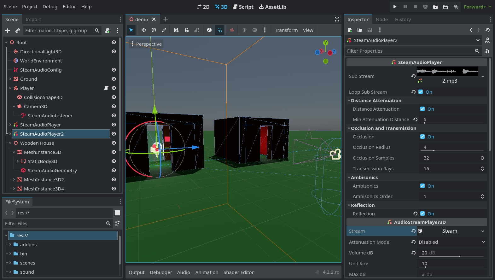

# godot-steam-audio
This is a GDExtension that integrates the [steam-audio](https://valvesoftware.github.io/steam-audio/) library
into Godot 4.2. This adds sound effects such as occlusion and reverb into the engine.

### [Demo Video](https://www.youtube.com/watch?v=vRnzfnb93Gw)

SteamAudio is a library made by Valve that improves aural immersion in games by adding effects such as
rotational and positional tracking and real-time sound propagation (occlusion and reflection). It is used in
[many games](https://steamdb.info/tech/SDK/Steam_Audio/), such as Counter-Strike 2 and Half-Life: Alyx, and
Valve offers [official plugins](https://valvesoftware.github.io/steam-audio/downloads.html) for Unity, Unreal,
and FMOD. This Godot extension is an unofficial plugin, but our end-goal is to offer the same features and
allow Godot devs to use them in their games. This extension is open-source and
MIT-licensed, while SteamAudio is Apache-licensed (but still open-source), as
per its [license](https://github.com/ValveSoftware/steam-audio/blob/master/LICENSE.md). Please note that
SteamAudio does use proprietary libraries, and to get a fully open-source extension you'll need to explicitly
compile everything by yourself to choose not to include them.

This extension is in an alpha phase, will have bugs and missing polish, and may crash. Don't expect to be able
to ship a game with this extension right now unless you are ready to make some fixes/optimizations to it on
your own (and if you do, PRs are accepted). Linux and Windows are currently working. Mac probably works, but I
don't have the time nor the money to support that, sorry.

### Features 
 - Spatial ambisonics audio 
 - Occlusion and transmission through geometry 
 - Distance attenuation
 - Reflections (reverb)

 To come: 
 - More editor configuration
 - Dynamic geometry
 - Baked scenes for higher-performance reflections
 - More raycasting support

### Getting started
Check [Installation](https://github.com/stechyo/godot-steam-audio/wiki/Installation) for how to install the extension, [Project setup](https://github.com/stechyo/godot-steam-audio/wiki/Project-setup) for how to integrate it with your project, and [Contributing](https://github.com/stechyo/godot-steam-audio/wiki/Contributing) if you're interested in improving the extension.

### Acknowledgements
godot-steam-audio is developed by [stechyo](https://github.com/stechyo).  
Check the [contributors](https://github.com/stechyo/godot-steam-audio/graphs/contributors) for other authors.

godot-steam-audio uses the Steam® Audio SDK. Steam® is a trademark or registered trademark of Valve
Corporation in the United States of America and elsewhere.
Steam® Audio, Copyright 2017 – present, Valve Corp. All rights reserved.

Vespergamedev's [GDNative module](https://github.com/vespergamedev/godot_steamaudio) was helpful in guiding the early development of this extension.

The icons for the SteamAudio nodes are from Godot, with color changes that match one of the colors in
the Steam Deck OLED page. These are MIT-licensed, so they are Copyright (c) 2014-present Godot Engine
contributors.
